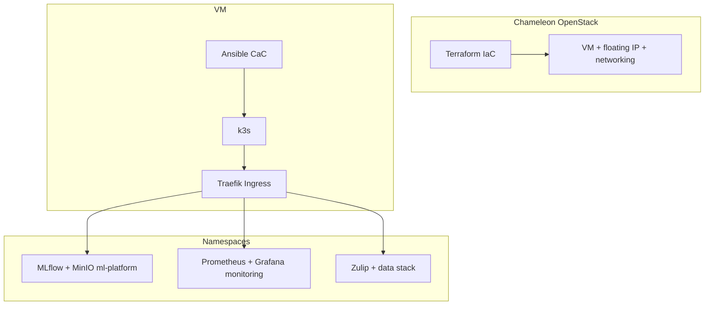

# Architecture (high level)

Reproducible **MLOps course** stack on **Chameleon Cloud** (`KVM@TACC`): OpenStack VM, single-node **k3s**, shared **MLflow**, **MinIO**, **Prometheus/Grafana**, and **Zulip** behind **Kubernetes Ingress**.

| Layer | Responsibility | Location in repo |
|-------|----------------|------------------|
| Cloud | VM, network, FIP | `infra/terraform/openstack/` |
| Node + cluster | k3s install, kubeconfig for `cc` | `infra/ansible/playbooks/k3s_install.yml` |
| Platform | Namespaces, MLflow, MinIO, Prometheus/Grafana | `infra/ansible/playbooks/deploy_platform.yml`, `k8s/` |
| Application | Zulip Helm (docker-zulip chart) | `infra/ansible/playbooks/deploy_zulip.yml`, `k8s/zulip/*.yaml` |

**Public HTTPS** terminates at **Traefik** (k3s default). TLS Secret `chameleon-nip-tls` is created on the cluster (not committed). **Zulip**, **MLflow**, **MinIO** (API + console), **Grafana**, and optionally **Prometheus** use separate **nip.io** subdomains on the same floating IP.

**Reference only:** `zulip/` is a **git submodule** pointing at upstream [zulip/zulip](https://github.com/zulip/zulip) (source study). Runtime images come from the **docker-zulip** Helm chart, not a local build from that submodule.
